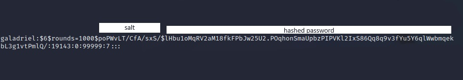

# Password Cracking

**Deliverable 1.** Provide screenshots similar to the ones above showing the last 3 entries in /etc/passwd and /etc/shadow.

<figure><figcaption></figcaption></figure>

<figure><figcaption></figcaption></figure>

**Deliverable 2.** Research what hashing algorithm is being used on this server, one of the fields in /etc/shadow points to the format. Explain this.

* It appears from the $6 it is SHA-512 hashing algorithm following a `username:$6$salt$hashedpassword`&#x20;

**Deliverable 3.** Examine user Galadriel's shadow entry.

* What is the salt?
  * poPWvLT/CfA/sxS/
* What is the hashed salt+password?
  * The hashed salt+password follows the salt i put above.

Provide a screenshot that shows each explicitly labeled.  Note, you may see a different format between password hashes.  Some explicitly indicate the number of "rounds".

<figure><figcaption></figcaption></figure>

**Deliverable 4.** Figure out how to use the unshadow utility to create a file usable by John the Ripper(JtR) and then crack the unshadowed files hashes using JtR. Provide a screenshot showing your results.&#x20;

<figure><figcaption></figcaption></figure>

<figure><figcaption></figcaption></figure>

**Deliverable 5.** Let's see if you can reverse engineer the shadow file using python. The grayed out area has the plaintext password for gandalf. In the clear text part, you can see the rounds and the salt. Provide a screenshot similar to the one below. Use Boromir or Galadriel's shadow entry.

<figure><figcaption></figcaption></figure>

**Deliverable 6.** Crack at least one of the hashes using hashcat and show the result in a screenshot similar to the one below:

<figure><figcaption></figcaption></figure>

**Deliverable 7.** Start a text or csv or markdown file similar to the one below. Include your successful guesses from Week 5 as well as the cracks from this week. We will need this data in our future adventures. A listing or screenshot of all your acquired passwords. This type of material is normally called "loot" in hacker parlance. Documenting uncracked hashes is also a great idea. You may have better luck cracking them as you learn more about your target or decide to crack on a real workstation instead of a kali vm.

| User           | Password          | Service |
| -------------- | ----------------- | ------- |
| samwise        | X                 | X       |
| samwise.gamgee | X                 | X       |
| bilbo          | X                 | X       |
| bilbo.baggins  | X                 | X       |
| pippin         | X                 | X       |
| peregrin.took  | 28Peregrin        | X       |
| frodo          | X                 | X       |
| frodo.baggins  | X                 | X       |
| gandalf.grey   | gandalfrockyou    | X       |
| boromir        | BoRomir2000Z      | X       |
| galadriel      | galadrielarwen111 | X       |

**Deliverable 8.** Develop your own password cracking content page

* How to grab password hashes, Can you extend the example to grab only those shadow accounts that have a hash? Some lines don't even have a hash.
* [unshadow](https://manpages.ubuntu.com/manpages/trusty/man8/unshadow.8.html)
* [Cracking with john](https://www.techtarget.com/searchsecurity/tutorial/How-to-use-the-John-the-Ripper-password-cracker)
* [Cracking with hashcat](https://www.freecodecamp.org/news/hacking-with-hashcat-a-practical-guide/)

**Deliverable 9.** As always, reflect on this lab and any challenges or areas you are not clear on. What do you think about password generators and managers now?

* I didn't realize password cracking took time, in the movies or shows it's usually like an "instant" thing so when I got to deliverable 4, it took me a while to understand that it takes time. I think password generators and managers are great and useful tools to use and I need to get on that.&#x20;
