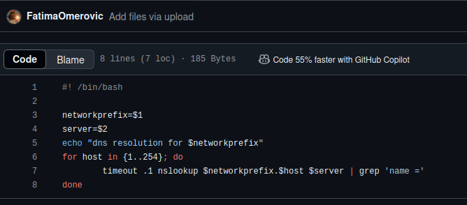

# The Metasploit Framework

## **Revisiting Cupcake**

In the following file: [Metasploit Framework demonstration-1.pptx](https://champlain.instructure.com/courses/2409450/files/350025237?wrap=1)[ Download Metasploit Framework demonstration-1.pptx](https://champlain.instructure.com/courses/2409450/files/350025237/download?download_frd=1), there is an illustration of the process of using the Metasploit Framework to achieve a foot hold on cupcake and escalating the privileges to root/Administrator.  If you've had experience with Metasploit in the past, feel free to exploit cupcake without use of the documentation.&#x20;

**Deliverable 1.**  A screenshot showing your session information from your foothold session and optionally, a screenshot showing your root shell.

&#x20;

<figure><figcaption></figcaption></figure>

<figure><figcaption>
msfconsole
</figcaption></figure>

<figure><figcaption></figcaption></figure>

<figure><figcaption></figcaption></figure>

<figure><figcaption>
set password as banana
</figcaption></figure>

<figure><figcaption>
Logged into the target firefart
</figcaption></figure>

## **Another Target**

**Deliverable 2.** Gain a foothold on Nancurinir using Metasploit. Provide a series of screenshots that document your interactions with the target via your Metasploit session(s). &#x20;

<figure><figcaption></figcaption></figure>

&#x20;

<figure><figcaption></figcaption></figure>

<figure><figcaption></figcaption></figure>

<figure><figcaption></figcaption></figure>

**Deliverable 3.** Document Metasploit usage to include Exploit selection, Payload selection and the other SET instructions required to get your exploits and metasploit sessions to work. Reflect on this activity and compare the relative merits of exploiting with the frameworks as compared to your hand crafted exploits.

* msfconsole: launches metasploit
* use: select what you want to use ex: payloads
* options: used this to set the rhost, lport, and etc.&#x20;

I had trouble with the target because of the passwd.bak file, but reverting the target resolved the issue instantly and I was able to progress.&#x20;
